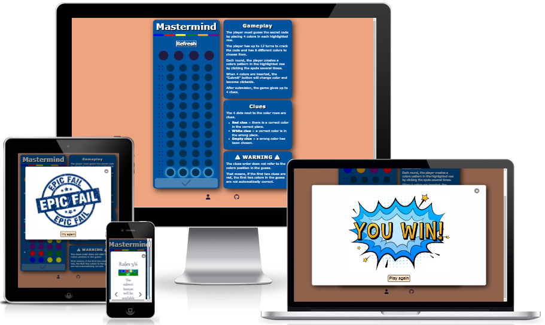
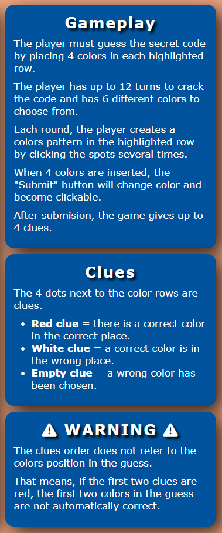
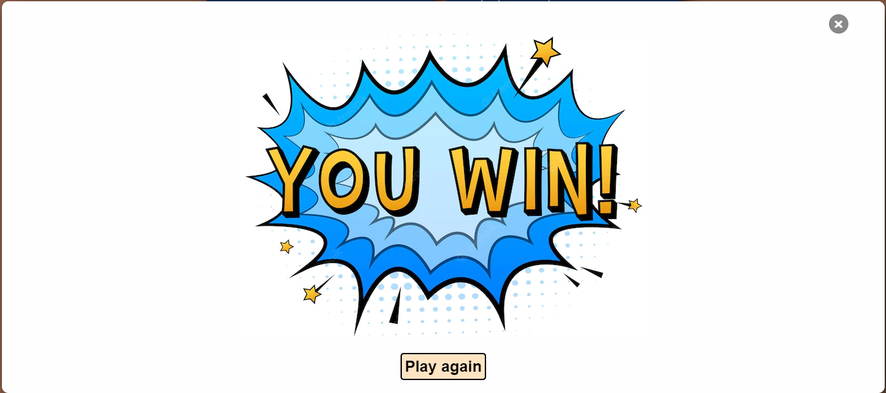
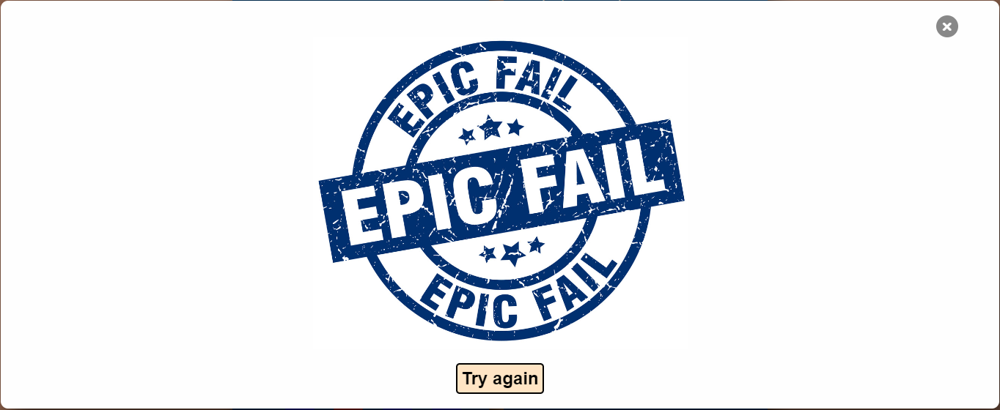
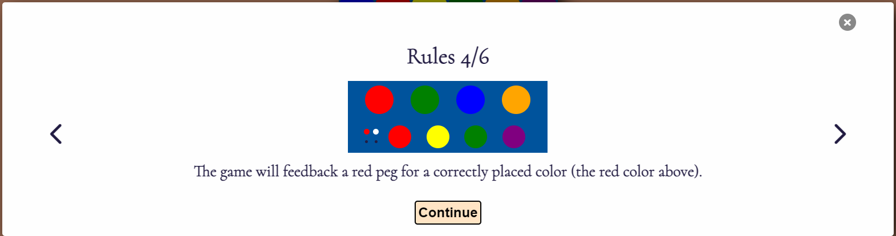

# mastermind-game

[Click here to access live project](https://ludovicleguen.github.io/Mastermind/)
## Table of contents
1. [Introduction](#Introduction)
2. [UX](#UX)
    1. [Ideal User Demographic](#Ideal-User-Demographic)
    2. [User Stories](#User-Stories)
    3. [Development Planes](#Development-Planes)
    4. [Design](#Design)
3. [Features](#Features)
    1. [Design Features](#Design-Features) 
    2. [Existing Features](#Existing-Features)
    3. [Features to Implement in the future](#Features-to-Implement-in-the-future)
4. [Issues and Bugs](#Issues-and-Bugs)
5. [Technologies Used](#Technologies-Used)
     1. [Main Languages Used](#Main-Languages-Used)
     3. [Frameworks, Libraries & Programs Used](#Frameworks,-Libraries-&-Programs-Used)
6. [Testing](#Testing)
     1. [Testing.md](TESTING.md)
7. [Deployment](#Deployment)
     1. [Deploying on GitHub Pages](#Deploying-on-GitHub-Pages)
8. [Credits](#Credits)
     1. [Media](#Media)
     2. [Code](#Code)
9. [Acknowledgements](#Acknowledgements)
***

## Introduction
The website allows users to play the Mastermind boardgame. 

This website is the second Milestone project (out of five) required to obtain the Diploma in Software development at The Code Institute.

The requirements of this project are:
* Build an interactive Front-End web application 
* Allow users to actively engage with data
* Displays information accordingly to users preferred goals
* Use HTML5, CSS3 and Javascript. 

[Back to top ⇧](#mastermind-game)

## UX
### Ideal User Demographic
There are two types of ideal users:
* Experienced player
* New user

### User-Stories
#### Experienced player Goals
* As an experienced player, I want to see a beautiful website.
* As an experienced player, I want a website easy to navigate.
* As an experienced player, I want to play a game instantaneously.

#### New User Goals
* As a new user, I want an intuitive and simple UI.
* As a new user, I want rules to be easily accessible.
* As a new user, I want a site pleasing to the eye.

[Back to top ⇧](#mastermind-game)

### Development-Planes
The website has to answer the aforementioned needs of all users types and therefore must have a single page containing the board game and the instructions.

#### Strategy
The website will focus on the following target audience
* Audience
    * New Users
    * Experienced players
    
* Demographic
    * All ages
    
* Psycho Characteristics
    * Curious
    * Determined
    * Puzzle solver

All Users must be able to:
* Play the Mastermind board game
* Find the instructions
* Restart a game at will
* Know when they win and loose
* Play each game with a random code to break 
   
#### Scope

Now that we have established the goals of the website we can deduce the necessary features and content:
* Required Content
    * The board game itslef
    * The instructions
    * Win and loose modals

* Required functionality
    * A Refresh button
    * An instruction button
    * Modals when user wins, looses or see instructions

#### Structure

The website will consist of 1 page. 

   1. **A Home page** hosting the game. All necessary information (such as rules) will be displayed uings Modals.   
    
#### Skeleton

With the structure now in place the designer has created wireframes on [Balsamiq Wireframes](https://balsamiq.com) as a base to build the website. The developper took the liberty to improve the design along the way. 

Desktop Wireframes

    

 

Tablet Wireframes

    

 

Mobile Wireframes

    

 

Winning Modal Wireframes

    

 

loosing Modal Wireframes

    

 

Instructions Wireframes

    

 

[Back to top ⇧](#mastermind-game)

### Design
#### Colour Scheme
The colors were chosen by the developper without using any generator.

There are 3 different color palettes.

Board and Background

The background uses #EEA47F .The board uses #00539C. The secret code uses #221c42 when it hides the colors to find. The rows uses #003153. Finally the glow and the submit button use #48abe0.

Colors to play with and pegs

The palette is entirely used by the user to choose the colors and break the code (except the white color). The feeback pegs use exclusively the red and white color.

Submit button and Modals

The submit button uses the green and green yellow colors. The modal uses #fefefe and bisque colors.

#### Typography

The developper has chosen 'Cormorant' from [Google Fonts](https://fonts.google.com/) Verdana, Geneva, Tahoma, sans-serif and 'Courier New'.

'Verdana' was used on the main board and rules, 'Cormorant' was used in the modals and finally 'Courier New' was used exclusively on the close button of the modal (letter x).

[Back to top ⇧](#mastermind-game)

## Features
### Design Features
The website consists of a single page with all features visible at one (except modals).

- **The Board** - The board is a responsive feature that is essentially the game.  
    All actions and users interfaces is on the board.
    The board had to be simple and yet clear enough to be understood at once.
    The board has a border shadow to give the impression it actually has a depth and hovers over the simple background.

- **The rules** - The rules are here to help first time users.  
    The rules are simple and cut in 3 parts.
    It serves a simple purpose: help users know how to play the game immediately.

- **Footer** - The footer contains 2 centered social links, takes the full width of any screen and has a fixed height. The links simply redirect to the gihub profile of the developper and to the repository.

- **Refresh button** - The refresh button refreshes the page and essentially resets the game. it is always visible, whatever the resolution of the device.

- **Rules button** The rules button appears only when the device width is lower than 750 px. It opens a modal that contains the rules. The rules are actually displayed in several pages with an intuitive interface to navigate them.

- **Secret code** The secret code is the goal of the game: users will play to break it. The secret color is revealed when the users break the code (and therefore wins) or when the users cannot break the code in less than 12 turns (and therefore lose). The secret code is randomly created at the beginning of each turn. The code can only contain 4 unique colors.

 
 

- **Board rows** - The refresh button refreshes the page and essentially resets the game.There are 12 rows and the players fills each one up to crack the code. The users clicks on the holders to toggle the color and therefore create a color guess.
In order to be clear to the user,rows are highlighted on at the time and the holder of this row are exclusively clickable. 

- **Feedback pegs** Each time the user submits a guess, the system feedbacks color pegs to give a clue. A red peg means a correctly placed color in the guess. A white peg means a color is not at the correct spot. 

- **Submit button** - The submit button "prints" the user choice and tells the system to compare the users guess with the secret code.
In order to be clear and simple to use, the button is not clickable as long as the user has not chosen 4 different colors.

- **The Modals** are a very important feature of the game. This is actually only one modal that is dynamically filled with content at opening and emptied when closed. Here is the different content:
        
    * The win Modal
    
    * The lose modal
    
    * The rules 
    
    
    
    
    
    

- **Continue button** - The continue button is used on each rules modal (6 of them). It allows the users to keep playing the actual game. 

- **Play Again button** - The play again button appears on the win modal and refreshes the page to play another game. 

- **Try Again button** - The try again button appears on the lose modal and refreshes the page to play another game. 

- **Color line** - The color line is actually not just a decoration. It actually shows the flow of colors when the users clicks the holders in the rows. 

### Existing Features
- **The board** - Main element of the unique page of the website.
- **The rules** - Second element of the unique page of the website.
- **Footer** - Found at the bottom of the page.
- **Refresh button** - at the top of the board. Allows users to reset a game
- **Rules button** - at the top of the board. Is available at all times and will not break a game when closed.
- **Secret Code** - Is randomized at the start of each game.
- **Board Rows** - The playing row is highlighted to help users know where to play. Only one row is clickable at a time.
- **Feedback pegs** - The feedback pegs are ssential to crak the secret code. A red pegs means a correctly placed color. A white peg means a misplaced color.
- **Submit button** - Is a vital feature to register people and communicate with the team.
- **Modals** - Actually a single modal is dynamically filled with content. This feature allows a single page approache and still show a lot of content.
- **Play/Try again buttons** - Appear with the win and lose modal respectively. They reload the page and start a new game. 
- **Color line** - Is both decorative and informative as its show the actual flow of colors when the user toggle colors. 

### Features to Implement in the future
- **Human VS Human** -
A human vs human mode could be fun. A user would create a secret code and the second player would have to find it.
- **Score Count** -
The score count could be added to motivate the user in beating either the CPU or a human.

[Back to top ⇧](#mastermind-game)

## Issues and Bugs 
During the development the debvelopper encountered several bugs and to his knowledge has corrected them all but one.
### Fixed Bugs
- **The modals** - The use of modals prooved to be more painful than expexted. The developper used IDs and classes to caracterize each different modal. In other words, the developper intended to create several modals instead of using just one and fill it with different content.
After several trials, the devlopper hascedcided to use different Template Literals wthat will fill the unique modal. 

- **The modal pictures** - The modal pictures were overflowing the modal container when screens were too small. A simple change in css of the "description img" class fixed the problem with
    margin: 0 auto;
    max-width: 100%;
    max-height: 100%;
    display: block;

- **The secret code random colors** - The secret code was able to have several identical in it. The same color could be used even 4 times. This caused problems with the clues. 
As a matter of fact, th real Mastermind rules mention that the code creater must not use twice the same color. The random color function was modified to fix that issue. 

- **The winning bug** - The users could still play after a win. If the user happened to close the Win Modal by clicking on the close button or outside the modal, they could still click on the colors pegs and therefore activate the submit button. The issue was fixed by createing a new function to set the onClick event to Null and therefore stop the game. 

### Unfixed Bugs 

- **The mobile modals** -The modals bottom content cannot be reached when the user flips the phone to landscape view. 

## Technologies Used
### Main Languages Used
* HTML5
* CSS3
* Javascript
### Frameworks, Libraries & Programs Used

[Back to top ⇧](#mastermind-game)

## Testing
Refer to this [page](TESTING.md) please

## Deployment
The site was developped on Gitpod, commiting and pushing to github.

### Deploying on GitHub Pages
To deploy this page to GitHub Pages from its GitHub repository, the following steps were taken:

1. Log into GitHub (or create an account if necessary).
2. Choose the GitHub Repository.
3. Select Settings from the menu items.
4. Select "Pages" from the left hand menu.
5. Under "Branch" click the drop-down menu labelled "None" and select "Main".
6. Click "Save".
7. Wait a few seconds up to a few minutes and refresh the page.
8. The site is now deployed and a link is provided.
    
[Back to top ⇧](#mastermind-game)

## Credits 
### Media
* The good luck image used in the rules modal (for mobiles) was taken from [flaticon.com](https://www.flaticon.com/fr/icone-gratuite/bonne-chance_5052310?related_id=5052360&origin=search)

* The rules of the games were largely inspired by [info.lite.games](https://info.lite.games/en/support/solutions/articles/60000688841-master-mind-deluxe-rules#:~:text=In%20MasterMind%20Deluxe%20the%20player,turns%20to%20crack%20the%20code.)

* The Fail picture used on the lose modal was taken from [vectorstock.com](https://www.vectorstock.com/royalty-free-vector/epic-fail-blue-round-grunge-stamp-vector-16796649)

* The Win image used in the Win modal was taken from [pngtree.com](https://pngtree.com/freepng/comic-speech-bubbles-with-text-you-win_7880780.html)

### Code 
* The color animation for the refresh and rules buttons were tken from [sliderrevolution](https://www.sliderrevolution.com*/)
* The submit icon glow was taken from [unused-css.com](https://unused-css.com/blog/css-outer-glow/)
* The Modal was inspiredby [w3schools](https://www.w3schools.com/w3css/w3css_modal.asp)
* Part of my code was inspired by John DeHart's game [Codebreaker](https://github.com/jdhart7/CodeBreaker)

## Acknowledgements

- I would like to thank my wife Dominika for her feedback and her patience with me.
- I would like to thank my my mentor, Koko for their invaluable help and guidance throughout the process.
- Last but not he least, I would like to sincerly thank my Slack companions who helped me a lot! 

[Back to top ⇧](#mastermind-game)

***

