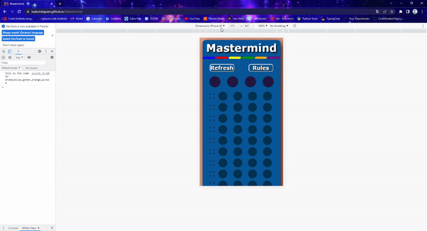
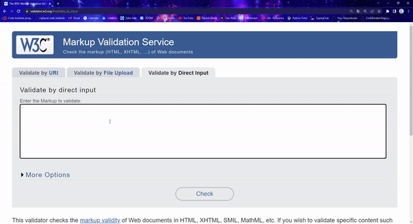
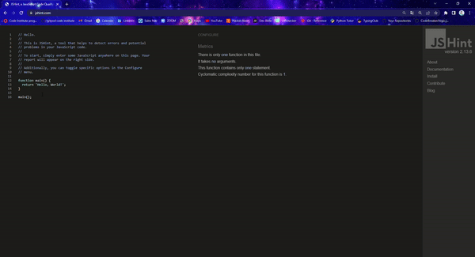
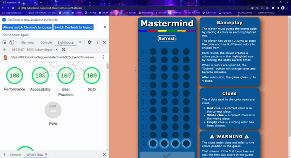
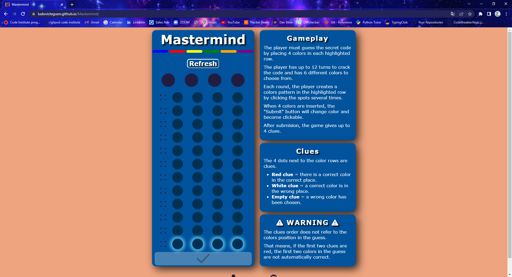
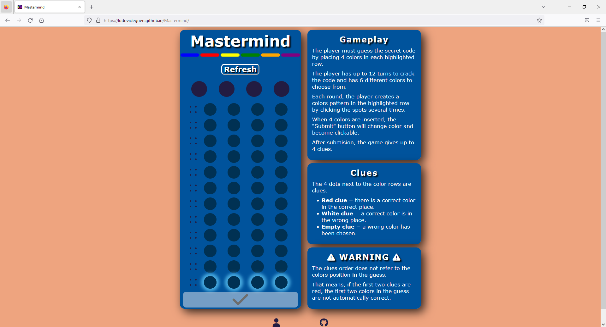
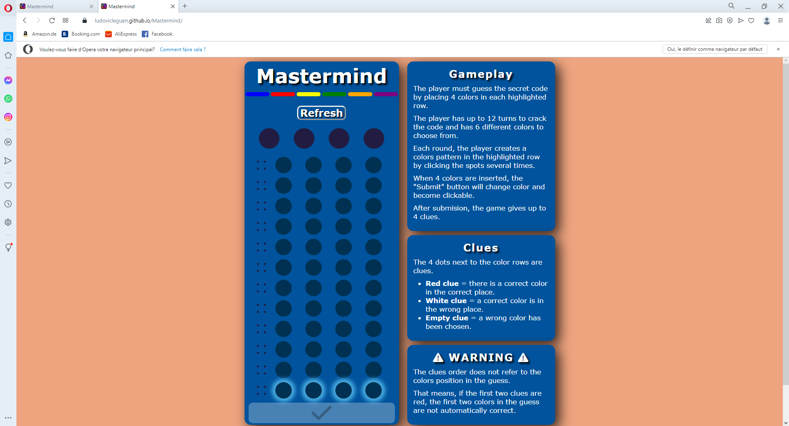
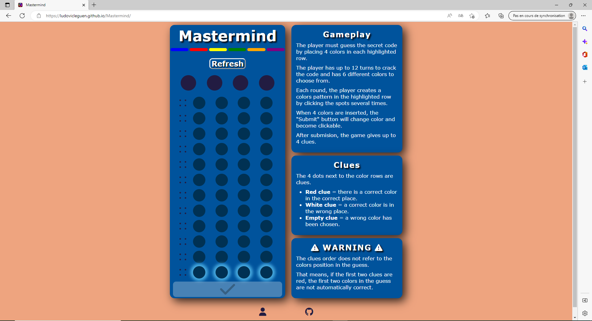

# Mastermind - Testing 

[Main README.md file](/README.md)

[View live project](https://ludovicleguen.github.io/Mastermind/)

[View GitHub repository](https://github.com/LudovicLeGuen/Mastermind)

***
## Table of contents
1. [Testing User Stories](#Testing-User-Stories)
2. [Manual Testing](#Manual-Testing)
3. [Automated Testing](#Automated-Testing) 
     - [Code Validation](#Code-Validation)
     - [Browser Validation](#Browser-Validation)
4. [User Testing](#User-Testing)

***

## Testing User Stories
#### Frequent User Goals:
* As an experienced player, I want to see a beautiful website.     
     * The design of the board and the color chosen trhoughout the game are considered beautiful by the developper. 
     * the pictures used in the modal are both fun and modern.

* As an experienced player, I want a website easy to navigate.
     * The information in the game are clear and in a single page
     * the rules are simply laid out and the ability to consult them immediately improves the UX.
     
* As an experienced player, I want to play a game instantaneously.
     * Again the one page approach and the design are so simple that an experience player will know instantly where to click and start a game.

#### New User Goals:
* As a new user, I want an intuitive and simple UI.
     * The one page aproach makes things simple and intuitive. 
     * All labels are clear and the UI is simple with buttons changing colors when there purpose is met (Submit button).

* As a new user, I want rules to be easily accessible.
     * The rules are immediately accessible for non mobile users and with one click for the mobile users. 
     * The use of 1 modal with several pages including a illustration of each major rules is very simple to use and very clear to understand for mobile users.

* As a new user, I want a site pleasing to the eye.
     * The color choice and the hover effects make the game pretty.
     * The layout of the game is also pretty harmonious and symettrical.

[Back to top](#Mastermind---Testing)
## Manual Testing
### Footer

* The footer links open in a new tab
     * Git links 

      
    
### Board Game
* The Refresh button is animated when hovered.

      

* The colors change when the spots are clicked.

      

* The submit button change color when 4 colors are inserted and becomes clickable. Once clicked it analyses the guess and gives a peg feedback.

     

* The refresh button reloads the page and therefore restarts the game.

     

* The rules on mobile open and navigate correctly. Closing them does not stop a game.

     

### Modals
* The Win modal appears when the player breaks the code and clicking "play Again" starts a new game.

     

* The Lose modal appears when the player does not break the code after 12 turns. Clicking "Try again" restarts the game 

     

* Losing or wining reveals the Code. 

          

### Responsiveness
* Game

     

[Back to top](#Mastermind---Testing)

## Automated Testing
### Code Validation
* HTML W3C code validation 

* CSS W3C code validation 

* JS validation 

* LightHouse validation 

[Back to top](#Mastermind---Testing)

### Browser Validation
* Chrome 

* Firefox 

* Opera 

* Edge 

[Back to top](#Mastermind---Testing)

## User testing 
Special thanks to the following who tested and gave me their feedback and ideas to improve the game:
* Callum Dennis (who held weekly calls and reviewed my work each time)
* Gary Grant (who guided me when I was lost)
* Ed Bradley (whose invaluable insight got me out of trouble more than once)
* Christopher Undritz (for spending so much time on reviewing my code and finding an important bug)
* Roger Pfäffli (who is always a source of wisdom and fun)
* Owonikoko Oluwaseun my mentor (the funniest and loveiest person. Cannot thank her enough for the guidance)

And last, but definitely not the least!
* My wife Domnika (who suffered me during the stressful times. Could not do it without her)

***